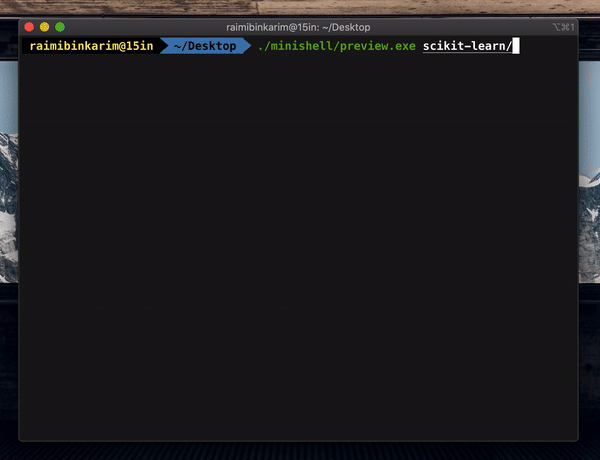

# minishell

This is a simple interactive shell with only 2 commands. I built this because a co-worker wanted to view a folder with 20+GB of files but couldn't do it with an `ls`. With this, I hope that we can casually explore a folder without slowing down the computer.



## Compiling

```bash
make
```

## Usage

```bash
./preview.exe /path/to/directory/
```

Path to directory must end with a forward slash.

Hit enter to view 10 files of a folder at a time, or you enter a filename and view nbytes.

## Similar programs

1. `ls`

2. `python -c "import os; l = os.listdir('.'); print(l)"`

## Features

* To be able to open the directory with negligible latency
* To be able to view a list of 10 files at a time
* To be able to read some contents of a file at a time
* Text-based files only (.txt, .csv, .log)

## Semi-features

* cd in this shell
* less
* To be able to copy files (?)

## Non-features

* No writing for now
* Sort files

## Use cases

* 20GB of data in a directory
